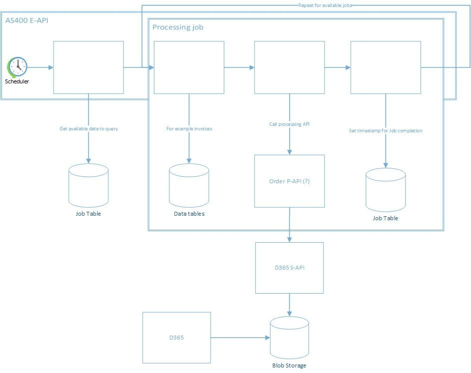

This is a caching service that can be used to retrieve picklist values from publishers who wish to provide a caching service for their picklist fields.

LOB Details: <<LOB Name>>
GitHub: <<URL>>
Asset owner: <<Owner Name>>
Development team : <<Team Name>>
Production Status : <<Deployment Date>>
Pattern: Bidirectional Sync
Confluence Page details: <<URL>>
Operation handbookpage: <<URL>>

